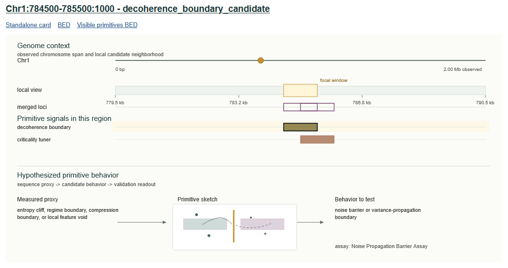
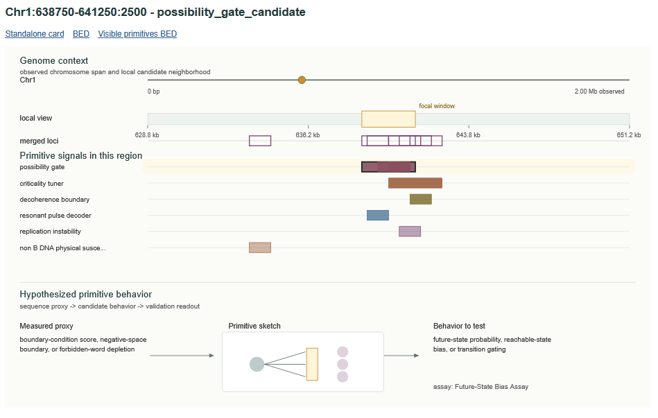

<p align="center">
  
</p>

# DarkDNA-Observer

DarkDNA-Observer is a sequence-first analysis toolkit for finding unusual
unannotated and noncoding genomic sequence architectures. It turns a genome plus
optional annotations into candidate regions, observed feature evidence,
primitive-hypothesis scores, residual anomaly scores, validation cards, HTML
reports, and genome-browser tracks.

The project is not a gene annotation pipeline and it is not a functional-claim
engine. Its job is narrower: rank genomic windows whose intrinsic sequence
architecture is unusual after classical covariates, matched null models, and
artifact flags have been considered.

Scientific mission: build an interpretable system for finding noncoding
architectures that current ontologies do not describe well, then turn those
architectures into falsifiable experimental hypotheses. The project does not
treat dark DNA, noncoding DNA, unannotated DNA, and junk DNA as synonyms. It is
a conservative hypothesis generator for loci that deserve better controls,
better context, and eventually one carefully chosen causal perturbation.

## Terminology

DarkDNA-Observer studies unannotated and noncoding genomic sequence
architectures. "Dark" is used operationally and does not imply that the regions
are functional, unassembled, or evolutionarily selected.

- Noncoding DNA is DNA that does not encode proteins. It can include enhancers,
  promoters, insulators, noncoding RNAs, replication origins, centromeres,
  telomeres, repeats, and sequence with no known function.
- Unannotated DNA is sequence without a reliable current annotation.
- Genomically dark DNA can mean sequence that is hard to assemble, map, or
  genotype, often because of repeats, segmental duplications, satellites, or
  related reference-quality issues.
- Junk DNA is a stronger evolutionary claim: sequence without a selected-effect
  function. Biochemical activity such as transcription, accessibility, or
  protein binding is not by itself evidence of selected biological function.

## Scientific Scope

Unannotated and noncoding genome research should ultimately combine at least
five layers:

- assembly and pangenome context
- evolutionary constraint
- cell-state-resolved epigenomics
- 3D genome context
- causal perturbation

The committed MVP mainly covers a narrower but potentially original layer:
intrinsic sequence architecture plus matched statistical controls. That scope is
intentional. It makes the sequence-derived signal auditable before adding
comparative, epigenomic, spatial, and perturbational evidence.

## What It Does

DarkDNA-Observer starts from genomic windows rather than genes. It can exclude
protein-coding exons, while retaining promoters, introns, transposable
elements, enhancers, cCREs, low-mappability regions, and other annotations as
covariates or risk labels.

For each window it computes sequence-derived views:

- base composition, CpG, entropy, k-mer spectra, compression, numeric walks
- repeat, palindrome, homopolymer, periodicity, and fork-texture proxies
- grammar features such as transition surprise, spacing periodicity, recurrent
  k-mers, forbidden-word depletion, and long-range dependency proxies
- left/right asymmetry and sequence-regime boundary features
- non-B-DNA susceptibility proxies such as G4, Z-DNA, triplex/H-DNA,
  cruciform, R-loop, and A-tract signals
- negative-space features that measure structured absence, deserts, and local
  feature voids
- transposable-element grammar features when TE annotations are available
- diagnostically gated multiscale texture, scaling-fit diagnostics, surrogate tests, and descriptive parent/child similarity

The outputs are candidate hypotheses for prioritization and assay design. A
high score means "this window deserves controlled follow-up", not "this window
has proven function".

## Primitive Properties

Primitive labels are operational hypothesis classes. They group windows by the
type of sequence evidence that dominates after residualization and matched-null
review, but the labels are not themselves observed molecular properties.

| Primitive candidate | Main evidence | What it means in this tool | Required follow-up |
| --- | --- | --- | --- |
| `fractal_scaffold_candidate` | multiscale texture screen, valid scaling interval, surrogate z-score, calibrated compression | Candidate multiscale sequence texture; this is not a confirmed fractal label. | Folding, compaction, or multiscale perturbation assays with shuffled controls. |
| `constraint_grammar_region_candidate` | grammar entropy, forbidden-word depletion, motif-like recurrence, Markov anomaly | Sequence grammar or spacing structure that is not explained by simple composition. | Grammar scramble, tiling, motif/spacing perturbation assays. |
| `non_B_DNA_physical_susceptibility_candidate` | structure-specific G4, i-motif, Z-DNA, triplex, cruciform, hairpin, slipped-DNA, R-loop, and A-tract Level-1 screens | Physical-susceptibility candidate based on sequence potential; context-conditioned formation and observed structure are separate evidence levels. | Structure-specific physical validation. No claim of quantum susceptibility or actual quantum effects. |
| `replication_instability_candidate` | fork texture, repeats, palindromes, skew, non-B propensity | Sequence architecture compatible with replication-stress susceptibility. | Replication timing, fork-pausing, or stress/recovery assays. |
| `chromatin_motion_oscillator_candidate` | spacing autocorrelation, bendability proxy, entropy asymmetry | Static sequence candidate for locus-motion or spatial-dynamics testing. | Live-locus motion or spatial-dynamics assays. |
| `decoherence_boundary_candidate` | entropy cliffs, boundary scores, compression changes, feature voids | Noise/variance boundary candidate from sequence-regime transitions. | Single-cell variance, reporter covariance, or noise-propagation assays. |
| `hysteresis_candidate` | GC asymmetry, nested repeats, non-B propensity, recurrent-kmer orientation | Candidate for history-dependent behavior testing. | Perturbation, recovery, and time/history interaction experiments. |
| `resonant_pulse_decoder_candidate` | 10 bp/147 bp periodicity, Fourier/autocorrelation spacing power | Periodic or phase-like sequence grammar candidate. | Pulse-frequency or time-course perturbation assays. |
| `possibility_gate_candidate` | boundary condition score, negative-space boundary, forbidden-word depletion | Boundary/constraint-like region that may alter reachable state tests. | State-transition, pseudotime, or fate-mapping validation. |
| `criticality_tuner_candidate` | sequence boundary, entropy boundary, compression boundary | Candidate threshold-like sequence transition. | Dose-gradient, perturbation-threshold, or recovery-rate assays. |
| `negative_space_element_candidate` | depleted k-mers, motif deserts, repeat/CpG/G-tract deserts, local voids | Structured absence that remains anomalous after controls. | Rescue/scramble assays that reinsert or disrupt missing tokens. |
| `sequence_regime_boundary_candidate` | left/right regime difference, entropy/GC/CpG/repeat/compression shifts | Candidate boundary between intrinsic sequence regimes. | Boundary smoothing, disruption, insulation, or accessibility assays. |
| `TE_grammar_node_candidate` | TE overlap, TE mosaic score, TE boundary score, TE orientation entropy | TE-derived or TE-mosaic sequence architecture beyond simple overlap. | TE-order/orientation perturbation and TE-derived regulatory comparison. |
| `unexplained_dark_anomaly_candidate` | high residual anomaly without one dominant class | A prioritized unannotated/noncoding window that needs review before interpretation. | Matched-null review, artifact checks, and orthogonal validation. |

Every primitive score is paired with calibration status, a component/correlation
audit, matched-null summaries when a named null exists, residual diagnostics,
and artifact-risk flags. An empirical p-value is `NA` unless a named null
distribution exists; ranks among observed genomic windows are not p-values.

The old internal/public label `quantum_susceptible_domain_candidate` has been
retired. G-richness, G4 propensity, oxidation-prone contexts, Z-DNA/R-loop/triplex
signals, and other non-B-DNA features support a conservative
`non_B_DNA_physical_susceptibility_candidate`. They do not support inference of
quantum susceptibility or charge-transfer dynamics without explicit physical
modelling of conformation, solvent, ions, stacking, base modifications, protein
binding, chromatin compaction, temperature, and electronic dynamics.

## Observed Feature Evidence vs Primitive Hypothesis

DarkDNA-Observer keeps two concepts separate.

Observed feature evidence is what the pipeline actually measures: sequence
composition, grammar, repeats, non-B-DNA proxies, negative-space measures,
boundaries, residuals, matched-null z-scores, empirical p-values, and artifact
flags.

A primitive hypothesis is the conservative interpretation proposed after those
measurements survive the available controls. Region cards therefore report both
`observed_feature_evidence` and `primitive_hypothesis`. The former is data; the
latter is an assay-generating claim that remains unconfirmed until an
appropriate validation experiment is performed.

The preferred interpretation order is:

```text
measured feature profile
  -> statistical anomaly after controls and null models
  -> post-hoc mechanistic hypothesis
```

The reverse order is not allowed: a high `hysteresis_candidate_score`, for
example, is not evidence that a locus has hysteresis. It is only a screening
view that can motivate a better calibrated anomaly analysis and, eventually, a
specific perturbation experiment.

## Composite Score Caveat

Canonical primitive score columns are covariance-aware, robustly
cohort-standardized screening views. They remain non-probabilistic and are not
null significance. Historical row-local equal-weight values are retained only
as `*_legacy_screening_composite` migration fields.

Before a composite can be treated as more than a ranking heuristic, the project
must show:

- why each feature and weight is used, or replace manual weights with a learned
  and validated model
- stability across organisms, strains, accessions, and assemblies
- robustness to sequence transformations such as reverse, scramble,
  dinucleotide-preserving shuffle, and k-mer-preserving shuffle
- absence of double counting among correlated features such as repeat density,
  entropy, compression, low complexity, and non-B-DNA proxies
- probabilistic calibration on held-out loci
- reproducibility under held-out chromosome or genomic-block splits

The pipeline writes `primitive_score_manifest.json` next to
`primitive_scores.parquet`. It records feature orientations, component
availability, correlation/double-counting audits, the covariance-aware
combination method, the explicit-null p-value policy, and validation work still
required before mechanistic interpretation.

## Classical Controls And Residuals

DarkDNA-Observer removes classical explanations in two separate ways.

First, matched nulls compare each region against nearby or similar windows using
available classical matching features: chromosome, GC, CpG, length/window size,
mappability, simple-repeat content, TE overlap, and local TE/GC/CpG background.

Second, residualization fits each primitive score from a dedicated classical
covariate table and ranks what remains. When the input contains multiple
chromosomes or genomic blocks, classical predictions are made out-of-chromosome
or out-of-block to reduce train/test leakage from overlapping windows:

```text
observed primitive score
  - predicted score from classical covariates
  = residual sequence-architecture anomaly
```

The committed pipeline writes this table as `classical_covariates.parquet`.
It includes composition, repeats, TE/cCRE/enhancer/promoter/exon/intron/UTR
overlap, blacklist/gap/segmental-duplication flags, mappability, scaffold-edge
distance, TSS distance, window size, and local background terms. It deliberately
does not use primitive score columns or hidden/anomaly-view columns as controls,
because that would regress away the signal being tested.

The result should be read together with `classical_model_global_r2`,
`matched_null_zscore`, `empirical_p_value`, and artifact flags. A high residual
with weak matched-null support is a review target; a high residual with strong
matched-null support is a stronger assay candidate.

A single matched-null z-score is still not sufficient. Candidate strength should
come from a panel of complementary null models, not from one convenient control
set.

Required null families include:

- same length and GC controls
- dinucleotide-preserving shuffles
- k-mer-preserving shuffles
- TE-family and TE-age matched controls
- chromatin-compartment matched controls
- replication-timing matched controls
- recombination, mutation, or damage-environment matched controls
- gene/TSS-distance matched controls
- nearby genomic controls
- syntenic ortholog controls
- population-frequency, copy-number, or presence/absence controls
- reversed or synthetic sequence controls

The current implementation provides `matched_controls_v1` and helper functions
for some sequence shuffles, but it does not yet run the full severe null panel.
The pipeline therefore writes `null_model_registry.json`, and region cards carry
`null_model_panel` so downstream users can see which null families are missing
or only partially available.

`classical_explanation_fraction` remains a deprecated compatibility alias for
`classical_model_global_r2`. The value is model-level, can be negative under
cross-validation, and is not a per-region causal variance decomposition.

## v2 Evidence Architecture

The v2 design keeps six modes separate until an explicit evidence-integration
stage:

- Mode A — sequence-specific intrinsic architecture (the current implemented workflow)
- Mode B — sequence-indifferent amount, length, copy, and spacing architecture (deferred to Phase 3)
- Mode C — context-conditioned conformation and molecular state (deferred)
- Mode D — transcription, RNA-product, and hidden-translation mechanisms (deferred)
- Mode E — dynamic perturbation and state-transition evidence (deferred)
- Mode F — evolutionary history, maintenance, and population evidence (deferred)

The planned Function Evidence Tensor will preserve causal role, organism-level
fitness, maintenance selection, origin selection, exaptation, selfish-element
evidence, deleterious burden, and replication as separate axes. The planned
Element Life-History model will separately represent birth, initial status,
persistence, current status, and transitions. Neither is faked by placeholder
zeros in Phase 1.

Mode B will test whether DNA amount, length, copy number, spacing, or occupancy
acts as a difference-maker when exact nucleotide identity is replaceable. Such
an effect would not demonstrate that the DNA originated or is maintained by
selection for that effect.

Phase 1 adds negative evidence as a first-class output. Missing controls produce
`insufficient_evidence`; decisive artifacts, null explanations, powered negative
perturbations, failed rescue, or failed replication can reject or downgrade a
candidate. The pipeline does not escalate every anomaly through increasingly
speculative assays.

## Assembly And Pangenome First

Before asking what a candidate does, ask whether the sequence is correctly
represented by the reference and whether that representation is typical for the
species, strain, accession, or population being studied.

DarkDNA-Observer is currently mostly reference-based. It already propagates
technical flags such as low mappability, assembly-gap overlap, segmental
duplication overlap, centromeric/telomeric or proximal-repeat context,
scaffold-edge proximity, high `N` fraction, and unplaced/unlocalized contig
status. Those flags are warnings, not complete assembly confidence estimates.

The assembly and pangenome module should add:

- assembly confidence and repeat-array completeness
- copy-number and presence/absence variation
- strain, accession, or haplotype specificity
- graph/pangenome coordinates
- lift-over between assemblies
- reference-to-reference comparisons such as C57BL/6J vs CAST/EiJ for mouse,
  then broader strain/accession panels

Without this layer, a high anomaly score may indicate a badly represented,
collapsed, difficult-to-map, or reference-specific region rather than a
biological sequence architecture.

## Overlapping Windows And Locus-Level Evidence

Multiscale windows are intentionally overlapping. A 1 kb window with a 0.5 step,
or a 1 kb window nested inside a 5 kb window, is useful for signal discovery but
is not an independent statistical observation. Raw window counts can therefore
inflate candidate totals, duplicate the same locus, leak nearby features between
train/test splits, and make scale persistence look stronger than it really is.

DarkDNA-Observer separates discovery windows from countable evidence:

- `candidate_primitives.parquet` remains a window-level diagnostic table.
- `candidate_loci.parquet`, `candidate_loci.tsv`, and `candidate_loci.bed`
  merge overlapping candidate windows by chromosome and primitive class.
- `locus_empirical_p_value` is computed at locus level from the best empirical
  p-value, corrected by the number of supporting scales rather than by the raw
  half-step window count.
- `global_bh_q_value` and `primitive_bh_q_value` apply Benjamini-Hochberg FDR
  correction across merged loci globally and within each primitive family.
- `block_id` and `chromosome_cv_fold` mark genomic blocks that should be used
  for block bootstrap or chromosome/block cross-validation. The residualizer
  uses leave-one-chromosome-out prediction when multiple chromosomes are
  present, otherwise leave-one-block-out prediction when multiple genomic
  blocks are available. Do not random-split overlapping window rows.
- `candidate_loci_block_bootstrap.tsv` summarizes primitive-level support by
  resampling genomic blocks, not individual windows. Small single-block fixtures
  are marked as insufficient independent blocks.
- `scale_discovery_window_size`, `scale_validation_window_sizes`, and
  `scale_validation_status` separate the strongest discovery scale from other
  overlapping scales that support the same merged locus.

Interpretation rule: use window-level rows to inspect where a signal came from,
but use locus-level rows for candidate counts, ranking, FDR, genome-browser
review, and follow-up prioritization.

## Interpretation Rules

DarkDNA-Observer deliberately stays conservative.

It can say:

- this window is sequence-derived and candidate-only
- this primitive score is high relative to matched controls
- this residual remains high after available classical covariates
- these features support or conflict with the candidate label
- these assays would test the hypothesis

It cannot say:

- the region has confirmed biological function
- biochemical activity proves selected-effect function
- a static sequence proves memory, oscillation, threshold behavior, state bias,
  or any other dynamic mechanism
- a physical-susceptibility proxy proves actual quantum effects
- a grammar-like pattern is a semantic code or a designed program

Confirmed dynamic interpretations require dynamic data such as time-course,
perturbation, recovery, single-cell state transitions, pseudotime, live-locus
motion, or dose-gradient experiments.

## Included Data

The repository includes enough data to run analyses immediately.

| Dataset | Path | Purpose |
| --- | --- | --- |
| Toy synthetic fixture | `data/toy/` | Fast deterministic smoke/integration data with known artificial candidate intervals. |
| Yeast R64 chrI subset | `data/reference/yeast_R64_chrI/` | Small real-genome technical fixture for *Saccharomyces cerevisiae* chromosome I. |
| Arabidopsis TAIR10 chr1 1-2 Mb subset | `data/reference/arabidopsis_TAIR10_chr1_2Mb/` | Small plant/non-model fixture for scaffold/GFF3 compatibility. |

The real fixtures are subset FASTA/GFF3 files plus chrom-size/checksum metadata.
They are intentionally small and versioned. Full source genomes are not kept in
the repository.

## Installation

DarkDNA-Observer targets Python 3.11 or newer.

Recommended Conda setup:

```powershell
cd C:\Users\User\Documents\darkdna-observer
conda env create --file environment.yaml
conda activate darkdna-observer
```

The `environment.yaml` file creates a dedicated `darkdna-observer` environment
from this repository's runtime and development requirements. It installs the
package in editable mode with `pytest` for local validation.

To update an existing environment after dependency changes:

```powershell
conda env update --file environment.yaml --prune
conda activate darkdna-observer
```

If this Windows Conda install raises `CERTIFICATE_VERIFY_FAILED` while solving
the environment, use the one-command workaround instead of changing global Conda
settings:

```powershell
conda env create --insecure --file environment.yaml
```

Without Conda:

```bash
python -m pip install -e ".[dev]"
```

Core dependencies are declared in `pyproject.toml` and mirrored in
`environment.yaml`: `typer`, `pydantic`, `pandas`, `numpy`, `scipy`,
`scikit-learn`, `pyarrow`, `jinja2`, `matplotlib`, `networkx`, and `PyYAML`.

Optional dependencies extend feature coverage for interval operations, FASTA
speedups, bigWig tracks, physical-shape modelling, scale/fractal summaries, and
boosted residual models. Missing optional libraries are skipped gracefully.

## Quick Start With Included Toy Data

Run the full pipeline against the committed toy fixture:

```bash
darkdna run --config configs/test_toy.yaml
```

On Windows PowerShell, to keep a live console log and save the same output:

```powershell
python -m darkdna.cli run --config configs/test_toy.yaml --outdir results/run_progress_toy |
  Tee-Object -FilePath results/run_logs/run_progress_toy.log
```

If you also need to capture native `stderr` without PowerShell formatting it as
`NativeCommandError`, let `cmd` merge the streams before `Tee-Object`:

```powershell
cmd /c "python -m darkdna.cli run --config configs/test_toy.yaml --outdir results/run_progress_toy 2>&1" |
  Tee-Object -FilePath results/run_logs/run_progress_toy.log
```

This is equivalent to running each stage manually:

```bash
darkdna make-windows --config configs/test_toy.yaml
darkdna extract-sequence-features --config configs/test_toy.yaml
darkdna score-primitives --config configs/test_toy.yaml
darkdna build-null-models --config configs/test_toy.yaml
darkdna residualize --config configs/test_toy.yaml
darkdna infer-primitives --config configs/test_toy.yaml
darkdna make-region-cards --config configs/test_toy.yaml
darkdna report --config configs/test_toy.yaml
darkdna make-tracks --config configs/test_toy.yaml
```

Results are written to `results/test_toy/`.

## Quick Start With Included Real Fixtures

Yeast:

```bash
darkdna run --config configs/test_yeast_R64_chrI.yaml
```

Or stage-by-stage:

```bash
darkdna make-windows --config configs/test_yeast_R64_chrI.yaml
darkdna extract-sequence-features --config configs/test_yeast_R64_chrI.yaml
darkdna score-primitives --config configs/test_yeast_R64_chrI.yaml
darkdna build-null-models --config configs/test_yeast_R64_chrI.yaml
darkdna residualize --config configs/test_yeast_R64_chrI.yaml
darkdna infer-primitives --config configs/test_yeast_R64_chrI.yaml
darkdna make-region-cards --config configs/test_yeast_R64_chrI.yaml
darkdna report --config configs/test_yeast_R64_chrI.yaml
darkdna make-tracks --config configs/test_yeast_R64_chrI.yaml
```

Arabidopsis:

```bash
darkdna run --config configs/test_arabidopsis_TAIR10_chr1_2Mb.yaml
```

Or stage-by-stage:

```bash
darkdna make-windows --config configs/test_arabidopsis_TAIR10_chr1_2Mb.yaml
darkdna extract-sequence-features --config configs/test_arabidopsis_TAIR10_chr1_2Mb.yaml
darkdna score-primitives --config configs/test_arabidopsis_TAIR10_chr1_2Mb.yaml
darkdna build-null-models --config configs/test_arabidopsis_TAIR10_chr1_2Mb.yaml
darkdna residualize --config configs/test_arabidopsis_TAIR10_chr1_2Mb.yaml
darkdna infer-primitives --config configs/test_arabidopsis_TAIR10_chr1_2Mb.yaml
darkdna make-region-cards --config configs/test_arabidopsis_TAIR10_chr1_2Mb.yaml
darkdna report --config configs/test_arabidopsis_TAIR10_chr1_2Mb.yaml
darkdna make-tracks --config configs/test_arabidopsis_TAIR10_chr1_2Mb.yaml
```

Results are written under `results/`.

## Regenerating Reference Fixtures

The committed reference fixtures can be regenerated from public Ensembl Genomes
sources:

```bash
python scripts/prepare_test_references.py \
  --dataset yeast_R64_chrI \
  --download \
  --force \
  --out data/reference/yeast_R64_chrI

python scripts/prepare_test_references.py \
  --dataset arabidopsis_TAIR10_chr1_2Mb \
  --download \
  --force \
  --out data/reference/arabidopsis_TAIR10_chr1_2Mb
```

The script downloads temporary full-source files, writes only the configured
subsets, and records checksums.

## CLI Commands

- `darkdna init`: write example configuration files.
- `darkdna run`: execute the complete config-driven pipeline with visible console progress.
- `darkdna make-toy-data`: create deterministic synthetic test data.
- `darkdna make-windows`: generate multiscale unannotated/noncoding genomic windows.
- `darkdna extract-sequence-features`: compute intrinsic sequence and annotation-derived features.
- `darkdna score-primitives`: combine features into candidate primitive scores.
- `darkdna build-null-models`: build matched null summaries.
- `darkdna residualize`: estimate residual anomaly after classical covariate controls.
- `darkdna infer-primitives`: assign candidate labels and merged locus-level candidates from residual and matched-null evidence.
- `darkdna make-region-cards`: create JSON/TSV candidate cards and assay blueprints.
- `darkdna report`: generate an HTML report and diagnostic plots.
- `darkdna make-tracks`: generate BED/bedGraph files for genome browsers.

## Key Outputs

Window generation writes:

- `dark_windows.bed`
- `dark_windows.parquet`

Feature, score, and residual commands write:

- `sequence_features.parquet`
- `primitive_scores.parquet`
- `primitive_score_manifest.json`
- `negative_evidence.json`
- `negative_evidence.parquet`
- `classical_covariates.parquet`
- `matched_nulls.parquet`
- `null_model_summary.parquet`
- `null_model_registry.json`
- `residual_scores.parquet`
- `residualization_summary.json`
- `primitive_labels.parquet`
- `candidate_primitives.parquet`
- `candidate_loci.parquet`
- `candidate_loci.tsv`
- `candidate_loci.bed`
- `candidate_loci_block_bootstrap.parquet`
- `candidate_loci_block_bootstrap.tsv`

Reporting writes:

- `region_cards.json`
- `region_cards.tsv`
- `darkdna_report.html`
- `multipanel_summary.svg`
- `classical_control_multipanel.svg`
- `residual_score_histogram.svg`
- `observed_vs_predicted_classical_score.svg`
- genome-browser BED/bedGraph tracks

## Region Cards

Region cards are designed for review and experiment planning. Each card
contains:

- candidate-only status and interpretation caveat
- coordinates and multiscale context
- primitive class and confidence
- top supporting and conflicting features
- residual and matched-null evidence
- artifact-risk flags
- controlled covariates
- mechanistic bridge: the physical or molecular process that would connect the
  measured sequence feature to the proposed phenotype
- required validation data
- recommended primitive-specific assay
- recommended classical validation assay
- control sequence design
- perturbation design
- expected positive and negative outcomes

The common design principle for assay blueprints is a difference-in-differences
contrast:

```text
effect = (Native_treatment - Native_control) - (ControlSequence_treatment - ControlSequence_control)
```

The report renders a primitive-specific version of that contrast for each card:
folding/compaction for `fractal_scaffold_candidate`, oxidation/G4 or physical
susceptibility for `non_B_DNA_physical_susceptibility_candidate`, fork pausing for
`replication_instability_candidate`, pulse/frequency response for
`resonant_pulse_decoder_candidate`, state-transition probability for
`possibility_gate_candidate`, and so on.

Temporal or memory-like candidates require sequence-by-treatment-by-time/history
validation before any dynamic interpretation.

### Example Card Visuals

Each HTML card now includes a compact visual panel. The upper half answers
"where is this candidate in the genome?": a chromosome-scale marker, a local
view around the focal window, merged candidate loci, and every non-`no_call`
primitive class overlapping that neighborhood. The lower half answers "what
could this candidate mean?": it sketches the measured sequence proxy, the
candidate primitive hypothesis, and the assay readout that would be needed to
test the bridge.



In this example, a `decoherence_boundary_candidate` is not a claim of physical
decoherence. It means the sequence window has boundary-like evidence such as an
entropy cliff, regime transition, compression boundary, or local feature void.
The generated hypothesis is that this region may behave like a noise or
variance-propagation boundary, which would need a noise-propagation or
single-cell variance assay before any dynamic interpretation is allowed.



In this example, a `possibility_gate_candidate` means the local sequence has
boundary-condition, negative-space, or forbidden-word-depletion evidence near
other primitive-labeled windows. The sketch proposes a state-transition or
reachable-state gating hypothesis, not a confirmed regulatory role. It becomes
meaningful only if a follow-up assay can show that the native sequence changes
state-transition behavior relative to matched controls.

## Mechanistic Bridge Requirement

Primitive assays are not allowed to jump directly from a computational sequence
feature to a dynamic phenotype. Each region card contains a mandatory
`mechanistic_bridge` field with:

- the measured sequence feature
- the proposed dynamic or molecular phenotype
- candidate intermediate processes
- bridge-specific validation evidence
- a status flag explaining whether direct primitive validation is allowed

For example, a `fractal_scaffold_candidate` does not automatically imply a
folding phenotype. The bridge must pass through evidence such as polymer
simulations, DNA shape models, nucleosome occupancy predictions, in vitro
nucleosome assembly, single-molecule force measurements, and length-matched plus
k-mer-preserved controls.

Likewise, a `resonant_pulse_decoder_candidate` does not follow automatically
from periodic sequence. The bridge must identify an intermediate mechanism such
as nucleosome phasing, TF cooperative binding, mechanosensitivity, replication
dynamics, or chromatin looping before a temporal pulse assay can be interpreted
as primitive validation.

If the bridge is unvalidated or missing, the assay remains exploratory. It can
generate bridge evidence, but it should not be reported as direct validation of
the proposed primitive.

## Causal Validation Hierarchy

Region cards recommend validation as a hierarchy, not as a single plasmid test.
Native-versus-scrambled reporter assays are useful, but they lose genomic
position, chromatin, 3D contacts, replication timing, allele context, nearby TE
context, and nuclear compartment. Stronger follow-up should escalate through:

- in silico mutagenesis and sequence-model sanity checks
- MPRA/STARR-seq or synthetic reporter libraries
- endogenous CRISPRi/CRISPRa where the locus remains in its native context
- small deletions, base editing, or prime editing of the candidate feature
- single-cell perturbation with RNA/ATAC/multiome readout
- knock-in or knockout models when organism and locus justify it
- phenotype under challenge, ageing, stress, differentiation, or development

Interpretation rule: an MPRA-positive sequence is not automatically a native
regulatory element, and a native perturbation effect is still not proof of a
primitive unless the mechanistic bridge is also supported.

## Supported Inputs

Required:

- genome FASTA or chrom sizes

Optional:

- GFF3/GTF/BED gene annotation
- blacklist BED
- TE BED/GFF3
- cCRE/enhancer/promoter BED
- mappability bigWig, bedGraph, or BED
- assembly gaps BED
- segmental duplication BED
- centromere/telomere BED

RepeatMasker-style TE annotations are supported through the TE BED/GFF3 path.
ENCODE-style cCRE/enhancer/promoter annotations can be used as BED covariates.
Named quantitative ATAC/RNA/ChIP signal-track ingestion is not yet a first-class
workflow; those tracks still need explicit config support beyond the current
mappability/signal helper utilities.

Graph/pangenome coordinates, explicit copy-number tracks, presence/absence
variation, lift-over chains, and assembly-confidence tables are not yet
first-class inputs. Until they are, candidate interpretation should remain
reference-scoped and assembly-caveated.

The MVP supports scaffold and contig genomes, plant and non-model genomes,
missing gene names, missing transcript biotypes, and non-GENCODE GFF3
attributes. It does not assume human chromosome names such as `chr1`.

## Scientific Roadmap

The next build order is:

1. Add an evolutionary and pangenome module: assembly confidence,
   repeat-array completeness, copy-number and presence/absence variation,
   strain/accession specificity, graph or pangenome coordinates, lift-over
   between assemblies, cross-species constraint, syntenic context, and
   allele-frequency or variation context where data are available.
2. Add a mouse real-data benchmark with curated FASTA, gene annotation,
   RepeatMasker/TE annotation, mappability, blacklist, gap, and centromere or
   telomere tracks.
3. Strengthen surrogate null models beyond the current matched controls,
   including same length/GC controls, dinucleotide-preserving shuffles,
   k-mer-preserving shuffles, TE-family/age matching, chromatin-compartment
   matching, replication-timing matching, recombination/mutation environment
   matching, gene/TSS-distance matching, nearby genomic controls, syntenic
   ortholog controls, population-frequency controls, and reversed or synthetic
   sequence controls.
4. Add held-out and locus-level statistical calibration: per-locus splits,
   out-of-sample calibration curves, larger-genome chromosome/block
   cross-validation benchmarks, false-discovery diagnostics, and matched-null
   calibration panels.
5. Add foundation-model baselines so primitive scores can be compared against
   Enformer, Borzoi, AlphaGenome, or equivalent sequence-to-function models
   rather than only against hand-built sequence views.
6. Make quantitative tracks first-class inputs: ATAC/RNA/ChIP/CUT&Tag,
   conservation, replication timing, recombination, methylation, and other
   bigWig/bedGraph signals with per-track summaries and report panels.
7. Choose one causal validation path and make it excellent: a single
   perturbation/readout pairing with native, scrambled, and matched-control
   sequences is stronger than many loose validation sketches.
8. Continue enforcing the boundary between observed features and primitive
   hypotheses in code, reports, cards, docs, and downstream benchmarks.

Other engineering work remains useful: CI jobs for real-fixture pipelines,
benchmark notebooks across organisms, richer diagnostic plots, release metadata,
a citation file, a changelog, and documented optional dependency groups per
workflow.

## Development

Run tests with:

```powershell
conda activate darkdna-observer
pytest
```

## License

This project is **source-available**, but it is **not open source**.

Copyright (c) 2026 Filippo Bergeretti. All rights reserved.

The code, documentation, examples, assets, logos, genomic feature definitions, scoring concepts, sequence-analysis logic, and associated research ideas are publicly visible for evaluation and portfolio-review purposes only.

You may not copy, modify, redistribute, repackage, publish, sublicense, use commercially, or create derivative works from this project without explicit written permission.

Scientific note: this project treats "quantum-susceptible" sequence regions conservatively as physical-susceptibility proxies based on sequence composition and context. It does not claim to demonstrate actual quantum effects in genomic sequences.

See [`LICENSE`](./LICENSE) for the full terms.

